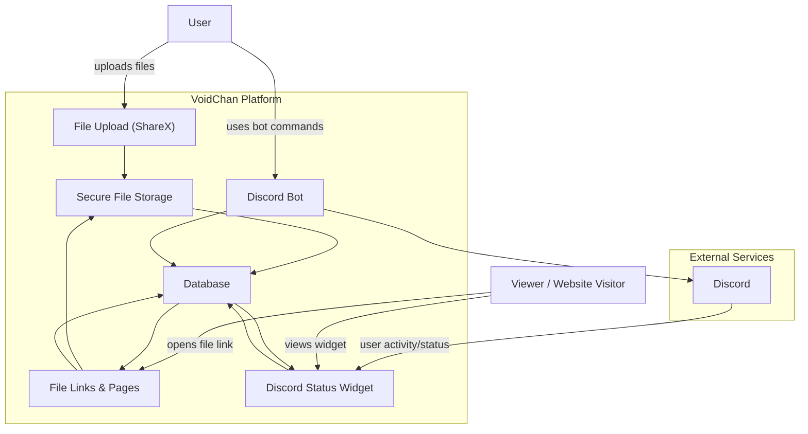

# VoidChan

<p align="center"></p>

**VoidChan** is a multi-purpose service written in Rust. It offers features such as uploading and sharing files with ease using [ShareX](https://github.com/sharex/sharex), integrates with Discord for account management, and includes a customisable Discord presence feature inspired by [Lanyard](https://github.com/Phineas/lanyard) to showcase your activity.

## Table of Contents

- [What VoidChan does](#what-voidchan-does)
- [Architecture Diagram](#architecure-diagram)
- [Get Started](#get-started)
  - [Register an account](#register-an-account)
- [Authenticated file uploads for ShareX](#authenticated-file-uploads-for-sharex)
  - [Import Method](#import-method)
  - [Manual setup](#manual-setup)
  - [Uploading files](#uploading-files)
  - [Upload result](#upload-result)
  - [File URLs](#file-urls)
    - [View URL](#view-url)
    - [Raw URL](#raw-url)
    - [Download URL](#download-url)
- [Discord bot commands](#discord-bot-commands)
  - [`/ping`](#ping)
  - [`/register`](#register)
  - [`/config`](#config)
  - [`/token`](#token)
  - [`/profile`](#profile)
  - [`/files`](#files)
  - [`/kv`](#kv)
- [Presence API](#presence-api)
  - [Get presence](#get-presence)
  - [Presence KV API](#presence-kv-api)
    - [Replace or set multiple KV entries](#replace-or-set-multiple-kv-entries)
    - [Set one KV key](#set-one-kv-key)
    - [Delete one KV key](#delete-one-kv-key)
  - [SVG presence widget](#svg-presence-widget)
    - [Widget endpoint](#widget-endpoint)
    - [Widget query parameters](#widget-query-parameters) 
- [Contributors](#contributors)
- [License](#license)

## What VoidChan does

- Upload images and files through **ShareX**
- Get short file links that open as a **preview page** or a **raw file URL**
- Manage your account from the **Discord bot**
- View your upload history in Discord
- Publish your **Discord presence** as JSON or an SVG widget
- Store custom presence-related **KV values** tied to your account

## Architecture Diagram



## Get Started

> [!NOTE]
> You need to [join VoidChan's Discord server](https://discord.gg/CqBf9vkD8m) to get started as VoidChan operates around your existence!

### Register an account

After joining the Discord server, you can run this slash command:

```
/register
```

This creates your VoidChan account and gives you:

- your VoidChan username
- your API token
- a ready-to-import ShareX uploader profile


If you are already registered, `/register` shows your existing setup details again.

## Authenticated files uploads for ShareX

VoidChan exposes a `POST /api/providers/sharex` endpoint that accepts a multipart upload with a `file` field and an API token in the `Authorisation` header.

After creating a VoidChan account, the bot gives you a JSON config you can import directly into ShareX.

### Import Method

1. Copy the JSON from the bot.
2. In ShareX, open **Custom uploader settings...**
3. Choose **Import** → **From clipboard**
4. Configure Destinations and Tasks

Once the JSON is imported, you need to tell ShareX to actually use the new uploader and what to do with the file once it's processed.

- Set the **Destinations**:
    - In the main ShareX window, go to **Destinations** in the sidebar.
    - Set **Image uploader** to **Custom image uploader**.
    - Set **File uploader** to **Custom file uploader**.
- Automate the Workflow:
   - **After capture tasks**: Ensure **Upload image to host** is highlighted (bold/active). This triggers the upload immediately after you finish selecting your screen area.
   - **After upload tasks**: Ensure **Copy URL to clipboard** is highlighted. This ensures the VoidChan link is ready to paste instantly without you having to manually grab it from the logs.

### Manual setup

If you want to set it up yourself, the uploader uses:

- **Request method:** `POST`
- **Request URL:** `https://voidchan.2rkf.fun/api/providers/sharex`
- **Body type:** `MultipartFormData`
- **File form name:** `file`
- **Header:** `Authorization: YOUR_API_TOKEN`
- **Success URL field:** `{json:url}`
- **Error field:** `{json:message}`

Example:

```json
{
  "Version": "19.0.0",
  "Name": "VoidChan",
  "DestinationType": "ImageUploader, FileUploader, TextUploader",
  "RequestMethod": "POST",
  "RequestURL": "https://voidchan.2rkf.fun/api/providers/sharex",
  "Body": "MultipartFormData",
  "FileFormName": "file",
  "Headers": {
    "Authorization": "YOUR_API_TOKEN"
  },
  "URL": "{json:url}",
  "ErrorMessage": "{json:message}"
}
```

The repository also includes example uploader files:

- `voidchan-sharex.json`
- `voidchan.2rkf.fun.sxcu`

### Uploading files

Once ShareX is configured, uploads are automatic.

VoidChan accepts uploads through:

```http
POST /api/providers/sharex
```

The request must include your API token in either:

- `Authorization`
- `Authorisation`

and the uploaded file must be sent as multipart form data with the field name:

```text
file
```

If your token is missing, invalid, or your account is blacklisted, the upload is rejected.

### Upload result

A successful upload returns JSON like this:

```json
{
  "code": 200,
  "url": "https://voidchan.2rkf.fun/v/abc12.png"
}
```

The exact returned URL depends on your preferred URL mode.

### File URLs

VoidChan exposes three main file URL styles.

#### View URL

```text
/v/<id>.<ext>
```

Example:

```text
https://voidchan.2rkf.fun/v/abc12.png
```

This opens VoidChan’s preview page with:

- file title
- uploader name
- MIME type
- size
- download button
- raw file link
- preview for supported file types
- social embed / Open Graph metadata

This is the default mode for new users.

#### Raw URL

```text
/u/<id>.<ext>
```

Example:

```text
https://voidchan.2rkf.fun/u/abc12.png
```

This serves the file directly.

#### Download URL

```text
/download/<id>.<ext>
```

Example:

```text
https://voidchan.2rkf.fun/download/abc12.png
```

This forces a file download.

---

## Discord bot commands

VoidChan’s main user interface is the Discord bot.

### `/ping`

Shows the bot gateway latency.

### `/register`

Creates your account and gives you:

- your username
- your API token
- ShareX setup instructions

### `/config`

Updates your preferences.

Options:

- `url_mode`: choose between `v` and `u`
  - `v` = preview page URL
  - `u` = raw file URL
- `hex_colour`: set your preferred accent colour, for example `#7289da`

Your preferred hex colour is used by the file preview page and presence widget styling.

### `/token`

It lets you either:

- view your current token
- regenerate your token

If you regenerate the token, update your ShareX config immediately, or uploads will stop working.

### `/profile`

Shows your VoidChan profile, including:

- account creation time
- preferred URL mode
- preferred hex colour
- total uploaded files
- total KV entries

### `/files`

Shows your uploaded files in Discord.

### `/kv`

Manages your custom presence KV store.

Subcommands:

- `/kv get [key]`
- `/kv set <key> <value>`
- `/kv delete <key>`
- `/kv clear`
- `/kv export`

KV limits:

- keys must be **alphanumeric only**
- keys can be at most **255 characters**
- values can be at most **30,000 characters**
- each user can store up to **512 keys**

---

## Presence API

VoidChan also features a Discord Presence service, which allows users to expose their Discord presence and activities. This feature is inspired by [Lanyard](https://github.com/Phineas/lanyard).

### Get presence

```http
GET /api/discord/<discord_user_id>
```

Example:

```http
GET https://voidchan.2rkf.fun/api/discord/123456789012345678
```

Response shape:

```json
{
  "success": true,
  "data": {
    "active_on_discord_web": false,
    "active_on_discord_desktop": true,
    "active_on_discord_mobile": false,
    "discord_user": { },
    "discord_status": "online",
    "activities": [ ],
    "listening_to_spotify": false,
    "spotify": null,
    "last_updated": 0,
    "kv": { }
  }
}
```

If the user is registered but currently offline, VoidChan can still return an offline presence payload for them.

### Presence KV API

VoidChan KV is a lightweight key-value system tied to your VoidChan presence. It allows you to store and retrieve small pieces of data that can be used for dynamic status displays, widgets, or custom integrations. You can manage the same KV data through HTTP using your API token.

#### Replace or set multiple KV entries

```http
PATCH /api/discord/<discord_user_id>/kv
```

Send a JSON object in the request body.

Example:

```bash
curl -X PATCH "https://voidchan.2rkf.fun/api/discord/123456789012345678/kv" \
  -H "Authorisation: YOUR_API_TOKEN" \
  -H "Content-Type: application/json" \
  -d '{"status": "coding", "project": "VoidChan"}'
```

#### Set one KV key

```http
PUT /api/discord/<discord_user_id>/kv/<key>
```

Example:

```bash
curl -X PUT "https://voidchan.2rkf.fun/api/discord/123456789012345678/kv/status" \
  -H "Authorisation: YOUR_API_TOKEN" \
  --data 'coding'
```

#### Delete one KV key

```http
DELETE /api/discord/<discord_user_id>/kv/<key>
```

Example:

```bash
curl -X DELETE "https://voidchan.2rkf.fun/api/discord/123456789012345678/kv/status" \
  -H "Authorisation: YOUR_API_TOKEN"
```

All KV write operations return the updated presence payload.

### SVG presence widget

VoidChan can render a live SVG card for a Discord user.

#### Widget endpoint

```http
GET /api/discord/<discord_user_id>/widget.svg
```

Example:

```text
https://voidchan.2rkf.fun/api/discord/123456789012345678/widget.svg
```

#### Widget query parameters

You can customise the widget using query parameters:

- `theme=light|dark`
- `accent=%23hexcode`
- `idle_message=something+here`
- `hide_status=true|false`
- `hide_elapsed_time=true|false`
- `hide_server_tag=true|false`
- `hide_badges=true|false`
- `hide_activity=true|false`
- `hide_spotify=true|false`

Example:

```text
https://voidchan.2rkf.fun/api/discord/516186529547288576/widget.svg?accent=%2316101f&idle_message=「ありがとう」もう言えないけど…幸せでした。
```
```md
[](https://discord.com/users/516186529547288576)
```

[](https://discord.com/users/516186529547288576)

## Contributors

<a href="https://github.com/reinacchi/voidchan/graphs/contributors">
  
</a>

## License

VoidChan is licensed under the [MIT License](LICENSE).
